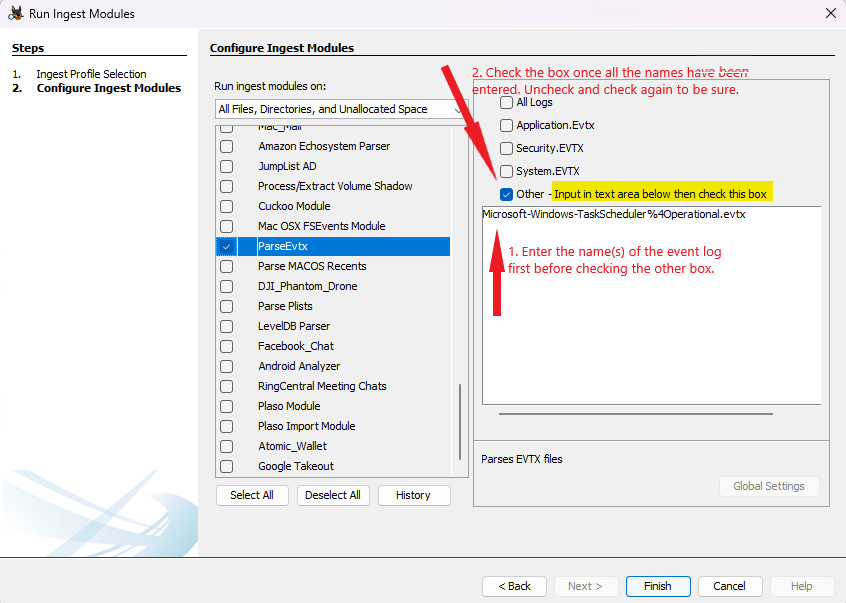

# Getting started with Autopsy

It can seem daunting when starting out in DFIR and looking at all the tools and how much money might need to be expended to get a lab set up to even practice. But don't despair, there are plenty of open source and free tools available that you can use. There is even a fantastic book been released called ["Digital Forensics with Open Source Tools"](https://www.amazon.com.au/Digital-Forensics-Open-Source-Tools") that outlines different tools and why you'd want to use open source to conduct forensic work.

In the Tools section of this site I'll be walking through the set up of the tools that I use in my CTFs, research and anything that I'm playing with that might be helpful.

> [Autopsy®](https://www.autopsy.com/) is the premier end-to-end open source digital forensics platform. Built by Basis Technology with the core features you expect in commercial forensic tools, Autopsy is a fast, thorough, and efficient hard drive investigation solution that evolves with your needs.

This is my set up and instructions for running Autopsy in a test environment for my purposes.

Last Update: 26 October 2023.

## Download and install the latest version of Autopsy 

Autopsy doesn't upgrade, it installs the next version alongside the old one. Remove the older version when you are happy the new version is working for you. This can be handy to test if there is a problem.

You can install multiple versions of Autopsy side-by-side.

1. Use winget: `winget install SleuthKit.Autopsy`
2. You can download Autopsy directly from the [website](https://www.autopsy.com/download/) and grab the latest version.

I've installed into C:\Program Files\Autopsy-4.19.3\ on a 1TB (onboard) SSD.

You generally find that the biggest bottle neck with forensics is the disk speed, so a high quality fast SSD is the best to be running any DFIR with.

Thank you to [Nik](https://sleuthkit.discourse.group/t/autopsy-setup-help/3258) who suggested that running two separate disk drives, one for the evidence files and one for the case directory, can greatly increase the speed of the process even when using slower drives.

There is an Autopsy [Discourse](https://sleuthkit.discourse.group/) for any questions or issues you may encounter. I strongly suggest signing up and taking a look through some of the previous questions and answers.

## Running Autopsy on 4k monitors

If you run Autopsy on a 4k monitor you will notice that everything is quite tiny. You can fix this by right clicking on the Autopsy icon and selecting properties, and "Change high DPI settings" to System (Enhanced).

While you are there I recommend selecting "Run this program as an administrator" and saving your changes.

## Autopsy Options 
Open Autopsy and then go to Tools > Options.
1. Applications
   * You can increase the Maximum JVM Memory for your system. I have 34GB available and set the Maximum to 14GB.
2. View
   * When displaying times - I set this to GMT
   * Maximum number of Results to show in table - This is essentially pagination (how many results per page in the results table). I like to scroll so I set this to zero.

## Turn on Wal journaling to speed up Single Case Mode 

This is a tip that [Mark McKinnon](https://github.com/markmckinnon) shared with me:
* Download an SQLite database editor. SQLite Spy for example.
* Open Autopsy and create a new case.
* Fill out all information to create the new case.
* Once you get to the step of adding a data source to the case cancel it by hitting the cancel button. The case has been created and ready to get the journaling mode changed from delete to Wal. [ref sleuthkit/autopsy#2518](https://github.com/sleuthkit/autopsy/issues/2518)
* Run SQLiteSpy
* Open Database > Browse to the case folder and open Autopsy.db
* Issue the following SQL command: Pragma Journal_Mode='wal' and execute it.  
* You should see that the journal mode is now wal.
* Close the database and close your SQLite editor.
* Open the case that you just created and add your data sources as normal.

## Adding Python Plugins 

These plugins greatly increase the number of ingest parsers that can run by Autopsy: [https://github.com/markmckinnon/Autopsy-Plugins](https://github.com/markmckinnon/Autopsy-Plugins). 

1. Clone or download the repository to your local machine.
2. Open Autopsy.
3. Go to Tools > Python Plugins.
4. This will open the directory where the plugins should reside - C:\Users\username\AppData\Roaming\autopsy\python_modules.
5. Make sure that the plugins are copied directly into the folder and you don't copy the higher level directory first.

You should see the plugin folder directly in the python_modules folder as shown above.

### Running ParseEvtx Python Ingest Module 
<ul>
   * If you add the name of an event log under other, you must add the name and THEN check the other box. To be sure I check it on then off and then on again. Separate the names with a comma.</ul>

   

<ul>
   * You know it's worked when you get the logs in Autopsy OR you check the log file and the list of names appears next to "Other".</ul>
   
   