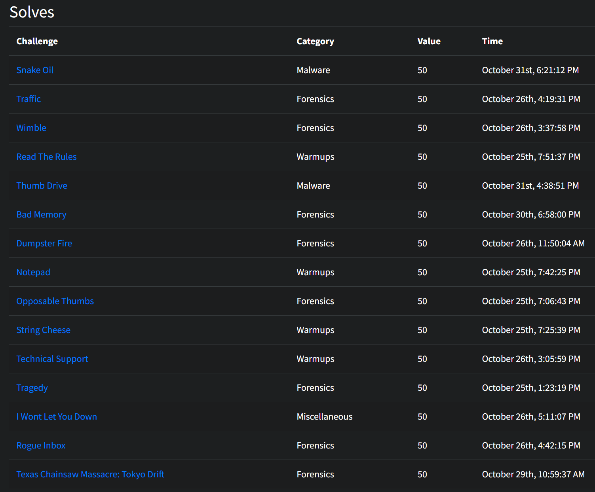

# Huntress CTF 2023
In October 2023, Huntress ran a [CTF](https://huntress.ctf.games/) to coincide with Cybersecurity awareness month. The competition ran from October 2, 12:00 PM ET - October 31, 11:59 PM ET, with new challenges released every day.

> "
> For this specific Capture the Flag competition, we hope to offer hands-on and practical exercises based around malware analysis, digital forensics and incident response, threat hunting or cyber threat intelligence, and general security. We will be releasing new challenges for you to play every single day throughout the month of October.
> "

I was late to the party and joined on October 25th and did what I could in those few days and completed 15 of the challenges across Forensics, Malware, Miscellaneous and warmups categories.

Any write ups for challenges not on that list I did after the challenge had finished. 

## Tool list by challenge
Below are some links and also the tools that I used to complete the challenges, mainly so that I have a place to come and remember!

### Forensics challenges
* Tragedy (easy)
  * N/A
* Opposable Thumbs (easy)
  * [xxd](https://linux.die.net/man/1/xxd)
  * [Thumbcache viewer](https://thumbcacheviewer.github.io/)
* Dumpster Fire (easy)
  * [Firefox decrypt](https://github.com/unode/firefox_decrypt)
  * [Firepwd](https://github.com/lclevy/firepwd)
* Wimble (easy)
  * PECmd.exe - [EZTools](https://github.com/EricZimmerman/Get-ZimmermanTools)
* Traffic (medium)
  * [rita](https://github.com/activecm/rita)
* Tragedy Redux (medium)
* Rogue Inbox (medium)
  * Timeline explorer - [EZTools](https://github.com/EricZimmerman/Get-ZimmermanTools)
* Bad Memory (medium)
  * [Volatility3](https://github.com/volatilityfoundation/volatility3)
  * [HashCat](https://hashcat.net/hashcat/)
* Texas chainsaw Massacre: Tokyo Drift (hard)
  * [Chainsaw](https://github.com/WithSecureLabs/chainsaw)
  * [CyberChef](https://gchq.github.io/CyberChef/)

## Malware challenges
* 

## Additional write-ups
The following people have written up their versions of the challenges, an incomplete list here:

* https://github.com/ThisGuyNeedsABeer/Huntress-CTF-2023/
* https://github.com/Psmths/ctf-writeups/tree/main/huntress-ctf-2023
* https://jjolley91.github.io/blog/huntress_ctf_2023/
* https://imported-variraptor-cc6.notion.site/Huntress-CTF-2-Oct-31-Oct-2023-9b810f83c0294d9d9151142364bbb63a
* https://github.com/ChaiChengXun2/Huntress-CTF

## Recommended resources

