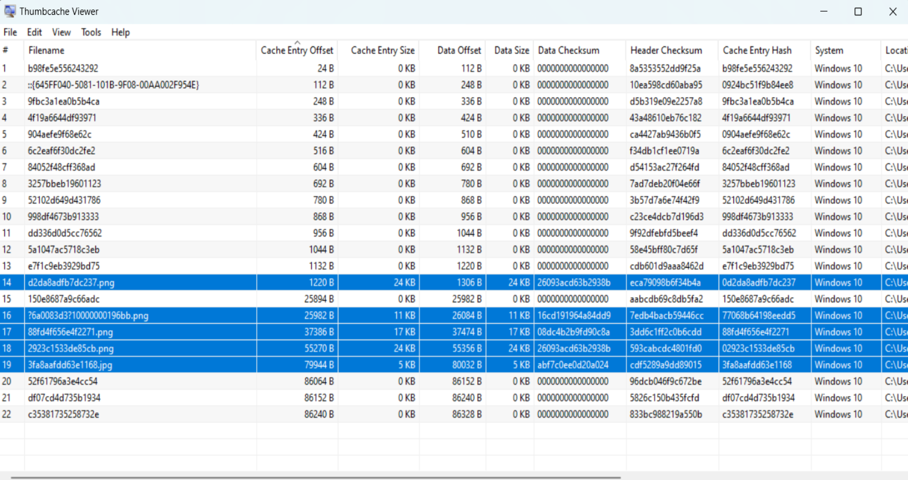

## Opposable thumbs

> We uncovered a database. Perhaps the flag is right between your fingertips!

Various computer operating systems include the ability to view picture and other files within a folder as smaller thumbnail images, representative of the file contents. In Microsoft Windows, this was introduced in Windows 95B and is enabled by storing thumbnail images in system container files, such as
Thumbs.db, or later; Thumbcache.db files. These, and other system files, store a range of information such as the original filename, and dates and times.

For this challenge we are provided with `thumbscache_256.db` and quickly checking the header before moving on we can see it is indeed a thumbcache database.

```shell
$ xxd -l 0x30 thumbcache_256.db
00000000: 434d 4d4d 2000 0000 0400 0000 0000 0000  CMMM ...........
00000010: 1800 0000 3851 0100 434d 4d4d 5800 0000  ....8Q..CMMMX...
00000020: 9232 2456 e5e5 8fb9 2000 0000 0000 0000  .2$V.... .......
```

The video below by 13Cubed on YouTube talks about the tool [Thumbcache viewer](https://thumbcacheviewer.github.io/){:target="_blank"} which can be used to analyse the contents of the db file. Opening the db file with Thumbcache viewer looks like this:



I noticed that there was five 'png' files and selected them and saved them locally. Opening the files revealed the flag in the image file `3fa8aafdd63e1168.jpg`.


flag{human_after_all}


# References and resources
* Two Thumbs Up - Thumbnail Forensics - 13Cubed episode - https://youtu.be/5efCp1VXhfQ?si=lIr84jihPb4taeLn
* Forensic Analysis of Windows Thumbcache files - http://www.csc.villanova.edu/~dprice/extra_handouts/Forensic_Analysis_of_Windows_Thumbcache_files.pdf