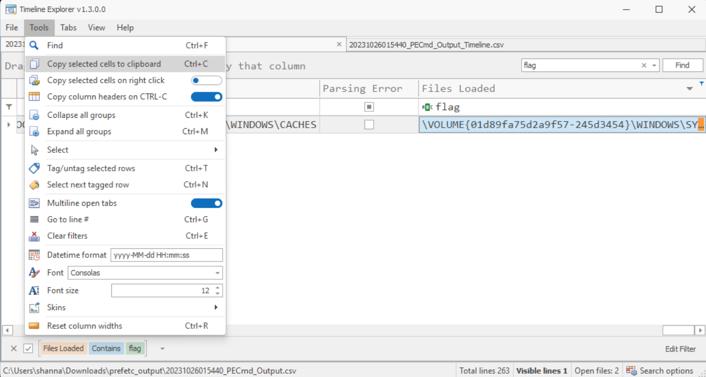

# Wimble

> Challenge:  
> "Gretchen, stop trying to make fetch happen! It's not going to happen!" - Regina George, Mean Girls

I have generally started out by checking each file it is what it claims to be and yes this was a 7zip file. So first step was unzipping the containing files.

   ```shell
   shanna@DFIR-work:/mnt/c/Users/shanna/Downloads$ file wimble.7z
   wimble.7z: 7-zip archive data, version 0.4

   shanna@DFIR-work:/mnt/c/Users/shanna/Downloads$ 7z l wimble.7z

   7-Zip [64] 16.02 : Copyright (c) 1999-2016 Igor Pavlov : 2016-05-21
   p7zip Version 16.02 (locale=C.UTF-8,Utf16=on,HugeFiles=on,64 bits,4 CPUs AMD Ryzen 9 5950X 16-Core Processor             (A20F12),ASM,AES-NI)

   Scanning the drive for archives:
   1 file, 6090097 bytes (5948 KiB)

   Listing archive: wimble.7z

   --
   Path = wimble.7z
   Type = 7z
   Physical Size = 6090097
   Headers Size = 114
   Method = LZMA2:6m
   Solid = -
   Blocks = 1

      Date      Time    Attr         Size   Compressed  Name
   ------------------- ----- ------------ ------------  ------------------------
   2023-05-31 09:31:49 ....A      6144852      6089983  fetch
   ------------------- ----- ------------ ------------  ------------------------
   2023-05-31 09:31:49            6144852      6089983  1 files

   shanna@DFIR-work:/mnt/c/Users/shanna/Downloads$ file fetch
   fetch: Windows imaging (WIM) image v1.13, XPRESS compressed, reparse point fixup

   shanna@DFIR-work:/mnt/c/Users/shanna/Downloads$ 7z e fetch -ofetch_output

   7-Zip [64] 16.02 : Copyright (c) 1999-2016 Igor Pavlov : 2016-05-21
   p7zip Version 16.02 (locale=C.UTF-8,Utf16=on,HugeFiles=on,64 bits,4 CPUs AMD Ryzen 9 5950X 16-Core Processor             (A20F12),ASM,AES-NI)

   Scanning the drive for archives:
   1 file, 6144852 bytes (6001 KiB)

   Extracting archive: fetch
   --
   Path = fetch
   Type = wim
   Physical Size = 6144852
   Size = 7337140
   Packed Size = 6113004
   Method = XPress:15
   Cluster Size = 32768
   Created = 2023-05-31 09:31:49
   Modified = 2023-05-31 09:31:49
   Comment = <WIM><TOTALBYTES>6144026</TOTALBYTES><IMAGE INDEX="1"><DIRCOUNT>1</DIRCOUNT><FILECOUNT>272</FILECOUNT><TOTALBYTES>7337140</TOTALBYTES><HARDLINKBYTES>0</HARDLINKBYTES><CREATIONTIME><HIGHPART>0x01D993A2</HIGHPART><LOWPART>0xB9804B63</LOWPART></CREATIONTIME><LASTMODIFICATIONTIME><HIGHPART>0x01D993A2</HIGHPART><LOWPART>0xB9804B63</LOWPART></LASTMODIFICATIONTIME><WIMBOOT>0</WIMBOOT><NAME>Fetch</NAME></IMAGE></WIM>
   Version = 1.13
   Multivolume = -
   Volume = 1
   Volumes = 1
   Images = 1

   Everything is Ok

   Folders: 1
   Files: 272
   Size:       7337140
   Compressed: 6144852

   ```

The folder is a prefetch folder with 265 prefetch files in it. I'll now jump back to Windows and use EZTools to parse the prefetch files.

   ```Powershell
   $ .\PECmd.exe -d C:\Users\shanna\Downloads\fetch_output\ --csv C:\Users\shanna\Downloads\prefetch_output\
   ```

Once that was completed I used the EZTools `Timeline explorer` to open the output csv file. Simply searched for "flag" and one line popped up.




Dropped it into Notepad++ and the searched for "flag".


flag{97f33c9783c21df85d79d613b0b258bd}


