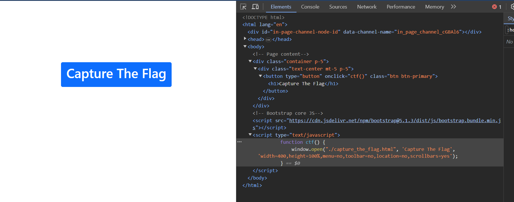
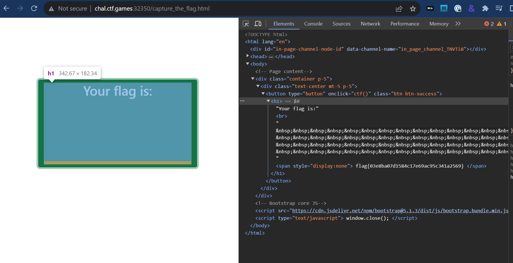

## F12

> Remember when Missouri got into hacking!?! You gotta be fast to catch this flag!

Press the start button and you'll be provided with a container URL to open. Open it.

When you open the click you see the words "Capture The Flag" and if you click on it a window briefly opens and then closes. OK, so we are not going to try and read it that way.

I open the page using "Inspect and take a look at the html associated with the button and see its open `./capture_the_flag`.

So then go and open hxxp://chal.ctf.games:32350/capture_the_flag.html

Once again taking a look at the button we can see the flag hidden in the html.


flag{03e8ba07d1584c17e69ac95c341a2569}
